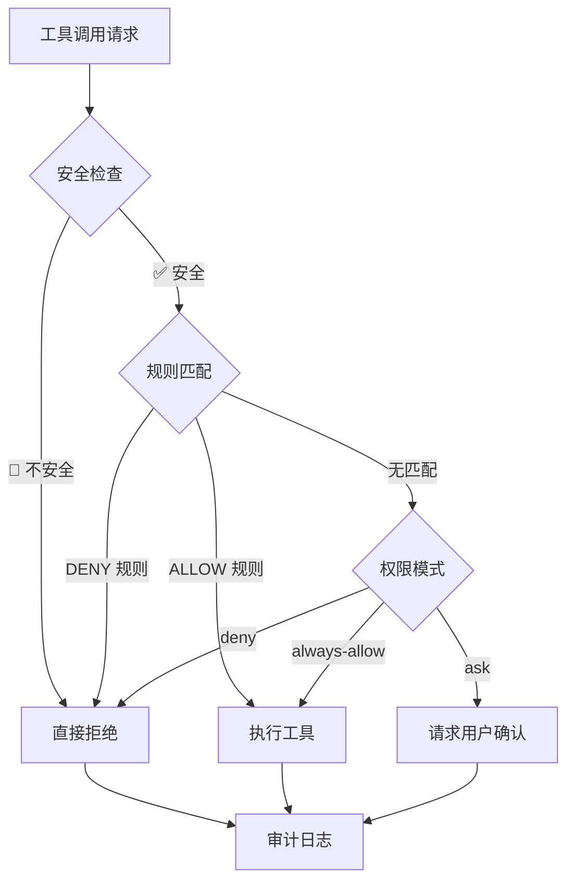

# AI Code Agent — Node.js Edition


> 基于 OpenAI 兼容协议的轻量级 AI 编程助手  
> 零外部依赖 · 纯 JavaScript · DeepSeek 默认 · 安全加固

[](https://www.npmjs.com/package/@raolin2025/claude-code-node) [](https://github.com/bg1avd/claude-code-node) [](https://opensource.org/licenses/MIT)
---

## 📦 安装

```bash
# npm 全局安装
npm install -g @raolin2025/claude-code-node

# 或 npx 直接运行（无需安装）
npx @raolin2025/claude-code-node

# 安装后使用 cc-node 命令
cc-node
```

## 🚀 快速开始

### 前置要求
- Node.js ≥ 18.0.0
- 至少一个 API Key：`DEEPSEEK_API_KEY`（默认）或 `LLM_API_KEY`（通用）

### 启动

```bash
# 进入项目目录

# 设置 API Key（DeepSeek 为默认）
export DEEPSEEK_API_KEY=your_key_here
# 或通用方式
export LLM_API_KEY=your_key_here

# 启动 REPL（默认使用 DeepSeek）
cc-node

# 一次性执行
cc-node "列出当前目录的文件"

# 指定模型
cc-node --model deepseek-reasoner

# 切换其他提供商
cc-node --model qwen-plus --api-base https://dashscope.aliyuncs.com/compatible-mode/v1

# 恢复上一次会话
cc-node --resume session-1747000000000-abc123
```

[](https://www.npmjs.com/package/@raolin2025/claude-code-node) [](https://github.com/bg1avd/claude-code-node) [](https://opensource.org/licenses/MIT)
---

## 📖 命令行参数

| 参数 | 短写 | 说明 | 默认值 |
|------|------|------|--------|
| `--model` | `-m` | LLM 模型名 | `deepseek-chat` |
| `--system-prompt` | `-s` | 系统提示词 | `""` |
| `--permission-mode` | `-p` | 权限模式 | `ask` |
| `--max-turns` | `-t` | 最大工具循环轮数 | `100` |
| `--api-base` | | API 基础 URL | `https://api.deepseek.com/v1` |
| `--resume` | `-r` | 恢复会话 ID | |
| `--verbose` | `-v` | 详细输出 | `false` |
| `--no-stream` | | 禁用流式响应 | `false` |
| `--help` | `-h` | 显示帮助 | |

### 权限模式

| 模式 | 说明 |
|------|------|
| `ask` | 每次工具调用需确认（安全，推荐） |
| `always-allow` | 自动允许所有工具调用（仍受安全策略约束） |
| `deny` | 拒绝所有工具调用 |

[](https://www.npmjs.com/package/@raolin2025/claude-code-node) [](https://github.com/bg1avd/claude-code-node) [](https://opensource.org/licenses/MIT)
---

## 💬 REPL 内置命令

进入 REPL 后，输入 `/` 开头的命令：

| 命令 | 说明 |
|------|------|
| `/help` | 显示帮助 |
| `/model NAME` | 切换模型 |
| `/tools` | 列出可用工具 |
| `/session` | 查看当前会话信息 |
| `/sessions` | 列出所有会话 |
| `/clear` | 清空当前对话 |
| `/config KEY` | 查看配置（支持点号路径如 `tools.bash.timeout`） |
| `/budget` | 查看 Token 预算使用情况 |
| `/exit` `/quit` | 退出（Ctrl+C 也可以） |

[](https://www.npmjs.com/package/@raolin2025/claude-code-node) [](https://github.com/bg1avd/claude-code-node) [](https://opensource.org/licenses/MIT)
---

## 🛠️ 内置工具（9 个）

| 工具 | 说明 | 权限级别 | 安全检查 |
|------|------|---------|---------|
| **Bash** | 执行 shell 命令 | `ask` | ✅ 命令安全扫描 |
| **Read** | 读取文件 | `always-allow` | ✅ 路径安全检查 |
| **Edit** | 精确文本替换编辑 | `ask` | ✅ 写入路径安全 |
| **Write** | 创建/覆盖文件 | `ask` | ✅ 写入路径安全 |
| **Glob** | 文件模式搜索 | `always-allow` | — |
| **Grep** | 内容搜索（rg/grep） | `always-allow` | — |
| **WebFetch** | 抓取网页内容 | `ask` | ✅ SSRF 防护 |
| **WebSearch** | 网页搜索 | `ask` | 需要 API Key |
| **GitTool** | GitHub PR 自动化（审查/合并/评论） | `high` | ✅ 预检查 |
| **AskUserQuestion** | 向用户提问 | `always-allow` | — |

[](https://www.npmjs.com/package/@raolin2025/claude-code-node) [](https://github.com/bg1avd/claude-code-node) [](https://opensource.org/licenses/MIT)
---

## 🔒 安全架构

本项目包含 **4 层安全防护**，总计 **964 行安全代码**：

### 1️⃣ SSRF 防护（178 行）
阻止 LLM 通过 WebFetch 访问内网和云元数据：

```
🚫 10.0.0.0/8          — 私有网络
🚫 172.16.0.0/12       — 私有网络
🚫 192.168.0.0/16      — 私有网络
🚫 169.254.0.0/16      — AWS/GCP 元数据
🚫 100.64.0.0/10       — 阿里云元数据 (100.100.100.200)
🚫 fc00::/7            — IPv6 唯一本地
🚫 fe80::/10           — IPv6 链路本地
✅ 127.0.0.0/8         — 回环（允许，本地开发）
✅ ::1                 — IPv6 回环
```

### 2️⃣ Bash 命令安全（279 行）
阻止 LLM 执行危险 shell 命令：

| 类别 | 示例 | 严重性 |
|------|------|--------|
| 破坏性操作 | `rm -rf /`, `dd of=/dev/sda`, `mkfs` | 🚫 CRITICAL |
| 敏感文件访问 | `cat /etc/shadow`, `~/.ssh/id_rsa` | 🚫 CRITICAL/HIGH |
| 远程执行 | `curl \| bash`, `wget \| sh` | 🚫 CRITICAL |
| 提权 | `sudo su`, `pkexec` | ⚠️ HIGH |
| 容器逃逸 | `nsenter --target 1`, 特权 docker | 🚫 CRITICAL |
| 内网数据外泄 | `curl http://192.168.x.x` | 🚫 CRITICAL |
| 系统重定向 | `> /etc/hosts` | 🚫 CRITICAL |

### 3️⃣ 路径安全防护（190 行）
防止 LLM 访问/修改敏感文件：

- **路径遍历检测** — `../../../etc/passwd` → 阻止
- **SSH 密钥保护** — 禁止读取 `~/.ssh/id_*` 私钥
- **系统目录写入保护** — 禁止写 `/etc/`, `/boot/`, `/usr/bin/`
- **敏感路径列表** — `/etc/shadow`, `/etc/sudoers` 等

### 4️⃣ 增强权限系统（310 行）



特性：
- **规则持久化** — 保存到 `.claude-code/permissions.json`
- **审计日志** — 记录到 `.claude-code/audit.log`
- **安全一票否决** — 即使规则允许，安全检查不通过仍拒绝

[](https://www.npmjs.com/package/@raolin2025/claude-code-node) [](https://github.com/bg1avd/claude-code-node) [](https://opensource.org/licenses/MIT)
---

## 🌐 API — OpenAI 兼容协议（全行业通用）

### DeepSeek（默认）
```bash
export DEEPSEEK_API_KEY=your_key_here
cc-node
```

### 其他 OpenAI 兼容提供商
```bash
# 通义千问
export LLM_API_KEY=your_key_here
cc-node --model qwen-plus --api-base https://dashscope.aliyuncs.com/compatible-mode/v1

# 智谱 GLM
cc-node --model glm-4-flash --api-base https://open.bigmodel.cn/api/paas/v4

# Moonshot Kimi
cc-node --model kimi-k2-0711 --api-base https://api.moonshot.cn/v1

# OpenAI
cc-node --model gpt-4o --api-base https://api.openai.com/v1

# Ollama 本地
cc-node --model qwen2.5 --api-base http://localhost:11434/v1
```

[](https://www.npmjs.com/package/@raolin2025/claude-code-node) [](https://github.com/bg1avd/claude-code-node) [](https://opensource.org/licenses/MIT)
---

## 📂 配置文件

### 项目级
`.claude-code/config.json` — 存放在项目根目录

### 用户级
`~/.claude-code/config.json` — 全局默认配置

### 配置项

```json
{
  "model": "deepseek-chat",
  "maxTurns": 100,
  "maxBudgetTokens": 1000000,
  "permissionMode": "ask",
  "tools": {
    "bash": { "timeout": 120 },
    "fileRead": { "maxLines": 2000 },
    "webFetch": { "timeout": 30 }
  },
  "mcp": {
    "servers": {}
  }
}
```

[](https://www.npmjs.com/package/@raolin2025/claude-code-node) [](https://github.com/bg1avd/claude-code-node) [](https://opensource.org/licenses/MIT)
---

## 🔌 MCP 服务器

支持通过 Model Context Protocol 连接外部工具服务器：

```javascript
import { MCPRegistry } from './src/mcp/index.js'

const registry = new MCPRegistry()
registry.register('my-server', {
  command: 'npx',
  args: ['my-mcp-server'],
  env: { API_KEY: 'xxx' }
})

await registry.connectAll()
const tools = registry.getAllTools()
```

[](https://www.npmjs.com/package/@raolin2025/claude-code-node) [](https://github.com/bg1avd/claude-code-node) [](https://opensource.org/licenses/MIT)
---

## 📊 项目结构

```
claude-code-node/              33 文件 · 4307 行
├── src/
│   ├── core/                  1279 行 — 引擎、CLI、会话、配置
│   ├── tools/                  944 行 — 9 个内置工具
│   ├── security/               964 行 — 4 层安全防护
│   ├── utils/                  544 行 — 差异、文件、进程、格式
│   ├── mcp/                    385 行 — MCP 客户端+注册表
│   ├── types/                  125 行 — 类型定义
│   ├── permission/              37 行 — 基础权限（兼容）
│   └── index.js                  8 行 — 入口
└── package.json
```

[](https://www.npmjs.com/package/@raolin2025/claude-code-node) [](https://github.com/bg1avd/claude-code-node) [](https://opensource.org/licenses/MIT)
---

## ⚠️ 安全注意事项

1. **始终使用 `ask` 权限模式** — 除非你完全信任 LLM 输出
2. **不要暴露 API Key** — 使用环境变量，不要硬编码
3. **WebSearch 需要单独配置** — 设置 `BRAVE_SEARCH_API_KEY` 或 `GOOGLE_SEARCH_API_KEY`
4. **审计日志定期审查** — 检查 `.claude-code/audit.log` 中的 DENY 记录
5. **安全规则可持久化** — 使用 `/allow` 命令添加会话级规则

[](https://www.npmjs.com/package/@raolin2025/claude-code-node) [](https://github.com/bg1avd/claude-code-node) [](https://opensource.org/licenses/MIT)
---

## 🔧 与原 Claude Code 的对比

| 特性 | 原版 (TypeScript/Bun) | 本版 (Node.js) |
|------|----------------------|----------------|
| 运行时 | Bun | Node.js ≥ 18 |
| 语言 | TypeScript | JavaScript (ESM) |
| 依赖 | ~200 npm 包 | **0 外部依赖** |
| 代码量 | 512,000+ 行 | 4,307 行 |
| 工具数 | ~40 | 9（核心） |
| API 协议 | Anthropic | **OpenAI 兼容（全行业通用）** |
| SSRF 防护 | ✅ | ✅ |
| 命令安全 | ✅ (2592行) | ✅ (279行) |
| 路径安全 | ✅ | ✅ |
| 审计日志 | ✅ | ✅ |
| MCP 支持 | ✅ 完整 | ✅ 简化版 |
| 流式响应 | ✅ | ✅ |
| 会话管理 | ✅ | ✅ |
| UI | Ink (React CLI) | 纯 readline |

[](https://www.npmjs.com/package/@raolin2025/claude-code-node) [](https://github.com/bg1avd/claude-code-node) [](https://opensource.org/licenses/MIT)
---

*基于 Claude Code 架构的 OpenAI 兼容重构*  
*零外部依赖 · DeepSeek 默认 · 安全加固 · MIT License*

## 📡 通讯通道 (Notification Channels)

cc-node 支持多平台消息推送，任务完成或出错时自动通知到手机。

### 支持的通道

| 通道 | 配置方式 | 说明 |
|------|----------|------|
| **Telegram** | Bot Token + Chat ID | 最推荐，支持 Markdown |
| **企业微信** | Webhook URL | 群机器人 |
| **飞书** | Webhook URL | 群机器人 |
| **Discord** | Webhook URL | 服务器频道 |
| **Slack** | Webhook URL | Incoming Webhook |
| **自定义** | HTTP URL + Method | 任意 Webhook |

### 快速配置 (Telegram 为例)

```bash
# 1. 在 Telegram 找 @BotFather 创建 Bot，拿到 Token
# 2. 获取你的 Chat ID（给 Bot 发消息后访问 https://api.telegram.org/bot<TOKEN>/getUpdates）
# 3. 设置环境变量
export CC_NODE_CHANNEL_TELEGRAM_TOKEN=123456:ABC-DEF
export CC_NODE_CHANNEL_TELEGRAM_CHAT_ID=78901234
export CC_NODE_CHANNEL_DEFAULT=telegram

# 4. 启动 cc-node，会自动加载
cc-node
```

### 配置文件方式

在 `.claude-code/config.json` 中：

```json
{
  "channels": {
    "telegram": {
      "type": "telegram",
      "token": "123456:ABC-DEF",
      "chatId": "78901234"
    },
    "qqbot": {
      "type": "qqbot",
      "token": "你的BotToken",
      "appId": "你的AppID",
      "channelId": "频道ID",
      "groupOpenId": "群OpenID"
    }
  },
  "defaultChannel": "telegram"
}
```

### REPL 命令

```
/channel list           — 列出已配置通道
/channel test           — 测试通道连通性
/channel send hello     — 手动发送消息
```

### 通知时机

- ✅ **任务完成**（one-shot 模式自动通知）
- ❌ **执行出错**（自动通知错误内容）
- 🔄 **手动发送**（`/channel send` 命令）

## 📱 QQ Bot 远端编程（v2.0 新增）

通过 QQ Bot API v2 实现远程编程控制。独立、零依赖、无需 OpenClaw。

### 前置配置

1. 前往 [QQ 开放平台](https://q.qq.com/) 注册机器人，获取 **AppID** 和 **AppSecret**
2. 在 QQ 中与机器人对话或拉入群，使用 `/bot-me` 获取你的 **OpenID** 或 **群 OpenID**
3. 配置环境变量：

```bash
export CC_NODE_CHANNEL_QQBOT_APPID=你的AppID
export CC_NODE_CHANNEL_QQBOT_SECRET=你的AppSecret
export CC_NODE_CHANNEL_QQBOT_GROUPID=你的群OpenID
```

### 使用方式

启动 cc-notify 后，直接给机器人发消息或在群中 @机器人：

```
帮我写一个快速排序
/ping
/status
/run ls -la
/notify 任务完成！
```

### 技术架构

```
QQ消息 → WebSocket (wss://api.sgroup.qq.com) → cc-notify → cc-node
cc-node → cc-notify → QQ API v2 (api.sgroup.qq.com/v2) → QQ消息
```

- **认证**: `appId + clientSecret` → `access_token`（自动续期，token 有效期 2 小时）
- **发送**: POST `/v2/groups/{group_openid}/messages` (群) 或 `/v2/users/{openid}/messages` (C2C)
- **接收**: WebSocket 长连接 + 心跳保活 + 自动重连
- **代码**: 基于 [qqbot-standalone](https://github.com/bg1avd/qqbot-standalone) 的架构
- **参考**: `src/channel/qqbot-listener.js`

---

## 🔔 后台运行 (cc-notify v2.0)

cc-notify 是独立的通知守护进程，**不需要 cc-node 在前台运行**，开机自启后随时可用。
支持 **Telegram** 和 **QQ Bot** 双通道远程编程。

### v2.0 新特性

- ✅ **QQ Bot 支持** — 通过 QQ 群/频道远程操控
- ✅ **增强版 Telegram 监听** — 速率限制、Markdown 安全编码、多轮对话
- ✅ **统一消息处理器** — 所有通道共享同一路由逻辑
- ✅ **长消息分段** — 自动切分超过 4000 字符的回复
- ✅ **API Key 持久化** — 自动生成并保存，重启不丢失

### 三种运行方式

| 方式 | 命令 | 说明 |
|------|------|------|
| **前台** | `cc-notify` | 调试用，Ctrl+C 退出 |
| **后台守护** | `cc-notify --daemon` | 脱离终端后台运行 |
| **系统服务** | `systemctl start cc-notify` | 开机自启，最推荐 |

### 手机交互

在 Telegram/QQ 上给 Bot 发消息：

```
你好                     → 当作一次性任务发给 cc-node 执行
/ping                    → 检查服务是否在线
/run ls -la              → 执行 shell 命令
/notify 任务完成！       → 向所有通道广播通知
/status                  → 查看服务状态
/cancel                  → 取消当前操作
```

### HTTP API（守护模式可用）

```bash
# 发送通知
curl -X POST http://localhost:3456/send \
  -H 'Content-Type: application/json' \
  -H 'X-API-Key: <你的API_Key>' \
  -d '{"text":"构建完成 ✅"}'

# 远程编程
curl -X POST http://localhost:3456/chat \
  -H 'Content-Type: application/json' \
  -H 'X-API-Key: <你的API_Key>' \
  -d '{"text":"帮我查下当前目录"}'

# 查看状态（无需 API Key）
curl http://localhost:3456/status
```

### systemd 开机自启

```bash
# 安装服务
sudo cp cc-notify.service /etc/systemd/system/
# 编辑 Token
sudo vim /etc/systemd/system/cc-notify.service
# 启用
sudo systemctl daemon-reload
sudo systemctl enable cc-notify
sudo systemctl start cc-notify

# 查看日志
journalctl -u cc-notify -f
```

## 🔧 GitTool - PR 自动化管理

GitTool 是 GitHub PR 自动化管理工具，支持查看、审查、合并 PR，以及批量操作和智能分析。

### 前置配置

```bash
# 1. 创建 GitHub Personal Access Token (classic, 有 repo 权限)
export GITHUB_TOKEN=ghp_xxx

# 2. 设置仓库信息
export GITHUB_OWNER=your_org
export GITHUB_REPO=your_repo

# 可选：启用 LLM 智能分析
export DEEPSEEK_API_KEY=sk-xxx
export DEEPSEEK_API_BASE=https://api.deepseek.com/v1
```

或在 `~/.claude-code/config.json` 中配置：

```json
{
  "github": {
    "owner": "your_org",
    "repo": "your_repo"
  },
  "llm": {
    "apiKey": "sk-xxx",
    "apiBase": "https://api.deepseek.com/v1",
    "model": "deepseek-chat"
  },
  "reviewRules": {
    "checks": {
      "codeQuality": true,
      "security": true,
      "tests": true,
      "docs": true
    }
  }
}
```

### 使用示例

在 REPL 中调用 GitTool：

```
/GitTool list-prs
/GitTool review-pr 123 --auto-comment false
/GitTool check-mergeable 123
/GitTool approve 123 "Looks good"
/GitTool merge-pr 123 --method squash
```

命令行脚本（`test-git-tool.mjs`）:

```bash
# 列出 PR
node test-git-tool.mjs list

# 审查 PR（规则检查，无 LLM）
node test-git-tool.mjs review 123

# 使用 LLM 智能分析
DEEPSEEK_API_KEY=sk-xxx node test-git-tool.mjs review-llm 123

# 检查可合并性
node test-git-tool.mjs check-mergeable 123

# Approve PR
node test-git-tool.mjs approve 123 "Approved"

# 提交审查意见
node test-git-tool.mjs comment 123 "Please add tests"

# 行级评论（自动计算 diff position）
node test-git-tool.mjs comment 123 "Fix needed" --path src/index.js --line 42
```

### 自动化工作流

- **每日自动审查**: 设置 cron 运行 `auto-review-all`
- **自动合并**: 为满足条件的 PR 添加 `auto-merge` 标签，运行 `auto-merge-eligible`
- **集成 OpenClaw Heartbeat**: 通过 `cron` 工具定期执行

```bash
# 每天 10:00 自动审查所有 PR
cron add "0 10 * * *" "session:git-automation" \
  --payload '{"kind":"agentTurn","message":"/GitTool auto-review-all"}'
```

### 合并策略

PRMergePolicy 支持以下检查（可配置）：

- ✅ 最少 Approvals 数量
- ✅ CI 状态全部通过
- ✅ 无 `changes_requested`
- ✅ 分支保护规则
- ✅ 自动合并标签（如 `auto-merge`）
- ✅ 合并冲突检测

### 安全与权限

- GitTool 工具注册为 `high` 权限级别（合并操作需要确认）
- 操作会被记录在审计日志中
- 禁止合并到受保护分支（main/master）

### 与 OpenClaw 集成

- GitTool 已内置到 cc-node 工具集中
- 可通过 `/tools` 查看
- 审查结果可与 QQ/Telegram 通道集成，发送通知

