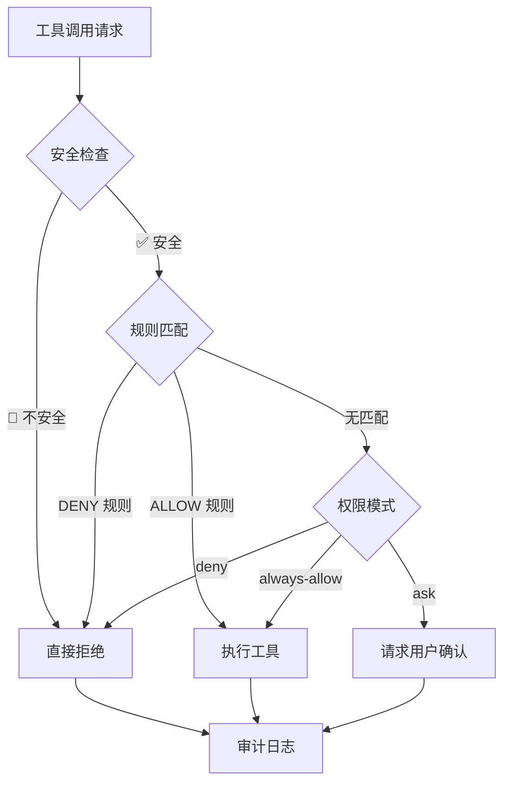

# AI Code Agent — Node.js Edition

> 基于 OpenAI 兼容协议的轻量级 AI 编程助手  
> 零外部依赖 · 纯 JavaScript · DeepSeek 默认 · 安全加固

---

## 🚀 快速开始

### 前置要求
- Node.js ≥ 18.0.0
- 至少一个 API Key：`DEEPSEEK_API_KEY`（默认）或 `LLM_API_KEY`（通用）

### 启动

```bash
# 进入项目目录
cd ~/.openclaw/workspace/claude-code-node

# 设置 API Key（DeepSeek 为默认）
export DEEPSEEK_API_KEY=***
# 或通用方式
export LLM_API_KEY=***

# 启动 REPL（默认使用 DeepSeek）
node src/index.js

# 一次性执行
node src/index.js "列出当前目录的文件"

# 指定模型
node src/index.js --model deepseek-reasoner

# 切换其他提供商
node src/index.js --model qwen-plus --api-base https://dashscope.aliyuncs.com/compatible-mode/v1

# 恢复上一次会话
node src/index.js --resume session-1747000000000-abc123
```

---

## 📖 命令行参数

| 参数 | 短写 | 说明 | 默认值 |
|------|------|------|--------|
| `--model` | `-m` | LLM 模型名 | `deepseek-chat` |
| `--system-prompt` | `-s` | 系统提示词 | `""` |
| `--permission-mode` | `-p` | 权限模式 | `ask` |
| `--max-turns` | `-t` | 最大工具循环轮数 | `100` |
| `--api-base` | | API 基础 URL | `https://api.deepseek.com/v1` |
| `--resume` | `-r` | 恢复会话 ID | |
| `--verbose` | `-v` | 详细输出 | `false` |
| `--no-stream` | | 禁用流式响应 | `false` |
| `--help` | `-h` | 显示帮助 | |

### 权限模式

| 模式 | 说明 |
|------|------|
| `ask` | 每次工具调用需确认（安全，推荐） |
| `always-allow` | 自动允许所有工具调用（仍受安全策略约束） |
| `deny` | 拒绝所有工具调用 |

---

## 💬 REPL 内置命令

进入 REPL 后，输入 `/` 开头的命令：

| 命令 | 说明 |
|------|------|
| `/help` | 显示帮助 |
| `/model NAME` | 切换模型 |
| `/tools` | 列出可用工具 |
| `/session` | 查看当前会话信息 |
| `/sessions` | 列出所有会话 |
| `/clear` | 清空当前对话 |
| `/config KEY` | 查看配置（支持点号路径如 `tools.bash.timeout`） |
| `/budget` | 查看 Token 预算使用情况 |
| `/exit` `/quit` | 退出（Ctrl+C 也可以） |

---

## 🛠️ 内置工具（9 个）

| 工具 | 说明 | 权限级别 | 安全检查 |
|------|------|---------|---------|
| **Bash** | 执行 shell 命令 | `ask` | ✅ 命令安全扫描 |
| **Read** | 读取文件 | `always-allow` | ✅ 路径安全检查 |
| **Edit** | 精确文本替换编辑 | `ask` | ✅ 写入路径安全 |
| **Write** | 创建/覆盖文件 | `ask` | ✅ 写入路径安全 |
| **Glob** | 文件模式搜索 | `always-allow` | — |
| **Grep** | 内容搜索（rg/grep） | `always-allow` | — |
| **WebFetch** | 抓取网页内容 | `ask` | ✅ SSRF 防护 |
| **WebSearch** | 网页搜索 | `ask` | 需要 API Key |
| **AskUserQuestion** | 向用户提问 | `always-allow` | — |

---

## 🔒 安全架构

本项目包含 **4 层安全防护**，总计 **964 行安全代码**：

### 1️⃣ SSRF 防护（178 行）
阻止 LLM 通过 WebFetch 访问内网和云元数据：

```
🚫 10.0.0.0/8          — 私有网络
🚫 172.16.0.0/12       — 私有网络
🚫 192.168.0.0/16      — 私有网络
🚫 169.254.0.0/16      — AWS/GCP 元数据
🚫 100.64.0.0/10       — 阿里云元数据 (100.100.100.200)
🚫 fc00::/7            — IPv6 唯一本地
🚫 fe80::/10           — IPv6 链路本地
✅ 127.0.0.0/8         — 回环（允许，本地开发）
✅ ::1                 — IPv6 回环
```

### 2️⃣ Bash 命令安全（279 行）
阻止 LLM 执行危险 shell 命令：

| 类别 | 示例 | 严重性 |
|------|------|--------|
| 破坏性操作 | `rm -rf /`, `dd of=/dev/sda`, `mkfs` | 🚫 CRITICAL |
| 敏感文件访问 | `cat /etc/shadow`, `~/.ssh/id_rsa` | 🚫 CRITICAL/HIGH |
| 远程执行 | `curl \| bash`, `wget \| sh` | 🚫 CRITICAL |
| 提权 | `sudo su`, `pkexec` | ⚠️ HIGH |
| 容器逃逸 | `nsenter --target 1`, 特权 docker | 🚫 CRITICAL |
| 内网数据外泄 | `curl http://192.168.x.x` | 🚫 CRITICAL |
| 系统重定向 | `> /etc/hosts` | 🚫 CRITICAL |

### 3️⃣ 路径安全防护（190 行）
防止 LLM 访问/修改敏感文件：

- **路径遍历检测** — `../../../etc/passwd` → 阻止
- **SSH 密钥保护** — 禁止读取 `~/.ssh/id_*` 私钥
- **系统目录写入保护** — 禁止写 `/etc/`, `/boot/`, `/usr/bin/`
- **敏感路径列表** — `/etc/shadow`, `/etc/sudoers` 等

### 4️⃣ 增强权限系统（310 行）



特性：
- **规则持久化** — 保存到 `.claude-code/permissions.json`
- **审计日志** — 记录到 `.claude-code/audit.log`
- **安全一票否决** — 即使规则允许，安全检查不通过仍拒绝

---

## 🌐 API — OpenAI 兼容协议（全行业通用）

### DeepSeek（默认）
```bash
export DEEPSEEK_API_KEY=***
node src/index.js
```

### 其他 OpenAI 兼容提供商
```bash
# 通义千问
export LLM_API_KEY=***
node src/index.js --model qwen-plus --api-base https://dashscope.aliyuncs.com/compatible-mode/v1

# 智谱 GLM
node src/index.js --model glm-4-flash --api-base https://open.bigmodel.cn/api/paas/v4

# Moonshot Kimi
node src/index.js --model kimi-k2-0711 --api-base https://api.moonshot.cn/v1

# OpenAI
node src/index.js --model gpt-4o --api-base https://api.openai.com/v1

# Ollama 本地
node src/index.js --model qwen2.5 --api-base http://localhost:11434/v1
```

---

## 📂 配置文件

### 项目级
`.claude-code/config.json` — 存放在项目根目录

### 用户级
`~/.claude-code/config.json` — 全局默认配置

### 配置项

```json
{
  "model": "deepseek-chat",
  "maxTurns": 100,
  "maxBudgetTokens": 1000000,
  "permissionMode": "ask",
  "tools": {
    "bash": { "timeout": 120 },
    "fileRead": { "maxLines": 2000 },
    "webFetch": { "timeout": 30 }
  },
  "mcp": {
    "servers": {}
  }
}
```

---

## 🔌 MCP 服务器

支持通过 Model Context Protocol 连接外部工具服务器：

```javascript
import { MCPRegistry } from './src/mcp/index.js'

const registry = new MCPRegistry()
registry.register('my-server', {
  command: 'npx',
  args: ['my-mcp-server'],
  env: { API_KEY: 'xxx' }
})

await registry.connectAll()
const tools = registry.getAllTools()
```

---

## 📊 项目结构

```
claude-code-node/              33 文件 · 4307 行
├── src/
│   ├── core/                  1279 行 — 引擎、CLI、会话、配置
│   ├── tools/                  944 行 — 9 个内置工具
│   ├── security/               964 行 — 4 层安全防护
│   ├── utils/                  544 行 — 差异、文件、进程、格式
│   ├── mcp/                    385 行 — MCP 客户端+注册表
│   ├── types/                  125 行 — 类型定义
│   ├── permission/              37 行 — 基础权限（兼容）
│   └── index.js                  8 行 — 入口
└── package.json
```

---

## ⚠️ 安全注意事项

1. **始终使用 `ask` 权限模式** — 除非你完全信任 LLM 输出
2. **不要暴露 API Key** — 使用环境变量，不要硬编码
3. **WebSearch 需要单独配置** — 设置 `BRAVE_SEARCH_API_KEY` 或 `GOOGLE_SEARCH_API_KEY`
4. **审计日志定期审查** — 检查 `.claude-code/audit.log` 中的 DENY 记录
5. **安全规则可持久化** — 使用 `/allow` 命令添加会话级规则

---

## 🔧 与原 Claude Code 的对比

| 特性 | 原版 (TypeScript/Bun) | 本版 (Node.js) |
|------|----------------------|----------------|
| 运行时 | Bun | Node.js ≥ 18 |
| 语言 | TypeScript | JavaScript (ESM) |
| 依赖 | ~200 npm 包 | **0 外部依赖** |
| 代码量 | 512,000+ 行 | 4,307 行 |
| 工具数 | ~40 | 9（核心） |
| API 协议 | Anthropic | **OpenAI 兼容（全行业通用）** |
| SSRF 防护 | ✅ | ✅ |
| 命令安全 | ✅ (2592行) | ✅ (279行) |
| 路径安全 | ✅ | ✅ |
| 审计日志 | ✅ | ✅ |
| MCP 支持 | ✅ 完整 | ✅ 简化版 |
| 流式响应 | ✅ | ✅ |
| 会话管理 | ✅ | ✅ |
| UI | Ink (React CLI) | 纯 readline |

---

*基于 Claude Code 架构的 OpenAI 兼容重构*  
*零外部依赖 · DeepSeek 默认 · 安全加固 · MIT License*
